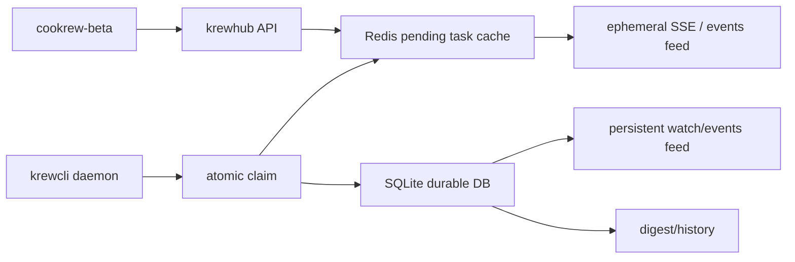

# Pending Task Redis Flow

Goal: unclaimed work should not become durable history. A task created by
Cookrew is a pending intent until a daemon actually claims it. Redis owns that
intent; SQLite owns claimed work, execution events, completion metadata, and
digest history.

## Current Problem

Today `POST /bundles/{bundle_id}/tasks` creates a row in `tasks` immediately
with `status='open'`. If no local `krewcli daemon` claims it, the final DB
accumulates cards that are permanently `UNCLAIMED`. The UI is then forced to
render stale history as if it were live work.

## Target State



## Data Ownership

| State | Owner | Durable DB row? | UI source |
| --- | --- | --- | --- |
| `pending` / unclaimed | Redis | No | bundle detail overlay + ephemeral SSE |
| `claimed` | SQLite | Yes | watch log / task SSE |
| `working` | SQLite | Yes | task events |
| terminal: `done`, `blocked`, `cancelled` | SQLite | Yes | history/digest |
| expired pending | Redis TTL | No | remove from UI via ephemeral SSE or next poll |

## Redis Keys

- `pending_task:{task_id}`: JSON task spec.
- `pending_tasks:bundle:{bundle_id}`: sorted set of task ids by creation time.
- `pending_tasks:recipe:{recipe_id}`: sorted set for daemon polling.
- `pending_claim:{task_id}`: short claim lock, set atomically.

Pending JSON should include:

```json
{
  "id": "task_x",
  "bundle_id": "bun_x",
  "recipe_id": "rec_x",
  "title": "Fix claim flow",
  "description": "",
  "depends_on_task_ids": [],
  "assigned_runtime_id": "rt_x",
  "created_by": "acc_x",
  "created_at": "2026-05-07T00:00:00Z",
  "expires_at": "2026-05-07T00:15:00Z",
  "ephemeral": true
}
```

## Write Flow

1. `POST /bundles/{bundle_id}/tasks` validates bundle ownership and paired
   runtime.
2. API writes task spec to Redis only, with TTL.
3. API returns the pending task payload to the UI with `ephemeral: true`.
4. API publishes an ephemeral event to the recipe SSE stream. This should not
   append to `watch_log`.
5. `GET /bundles/{bundle_id}` returns persistent DB tasks plus pending Redis
   tasks. Pending tasks keep the same API shape but are marked `ephemeral`.

## Claim Promote Flow

Claim must be atomic:

1. Daemon polls claimable pending tasks by recipe.
2. `POST /tasks/{task_id}/claim` first checks SQLite.
3. If no DB row exists, API runs a Redis Lua script:
   - read `pending_task:{task_id}`
   - verify dependency ids are terminal in SQLite or pending constraints pass
   - set `pending_claim:{task_id}` with short TTL
   - remove task id from recipe/bundle pending sets
   - return the pending task JSON
4. API inserts the task into SQLite directly as `claimed`, with
   `claimed_by_agent_id`, `claimed_at`, `assigned_runtime_id`, and sandbox id
   if provisioned.
5. API creates the durable `task_claimed` event and watch record.
6. API deletes the pending Redis JSON only after the DB commit succeeds.

If the DB write fails, restore the Redis pending set membership and release the
claim lock. If the daemon crashes after claim succeeds, the existing orphan
recovery path handles the durable claimed/working task.

## Expiry Flow

Pending tasks should have a short TTL, for example 15 minutes. Expiry means
"never accepted by an agent", so no SQLite row is written. A lightweight
sweeper can publish an ephemeral `task.expired` SSE event for subscribed UIs;
otherwise the next bundle refresh will simply stop returning the task.

## Event Feed Rules

- Pending lifecycle events use ephemeral SSE and Redis pub/sub/stream.
- Claimed and later lifecycle events use the existing SQLite `events` and
  `watch_log` path.
- The UI should visually distinguish `UNCLAIMED` pending cards as ephemeral,
  because refresh/expiry can remove them.

## Rollout Plan

1. Add a `PendingTaskStore` interface with Redis implementation and in-memory
   test fallback.
2. Change `TaskService.add_task` and `BundleService.create_bundle(tasks=...)`
   to create pending specs instead of `tasks` rows for manual/open work.
3. Overlay pending tasks in `GET /bundles/{id}` and daemon claim polling.
4. Promote pending specs inside `claim_task` before existing claim validation.
5. Move sandbox provisioning from task creation to claim promotion.
6. Add TTL expiry and ephemeral SSE.
7. Run one-time cleanup for old test bundles/tasks from the final DB.

Graph-attached tasks can use the same pending store after graph validation:
the graph artifact remains durable on the bundle, while executable node tasks
remain pending until claimed. The graph runner should read the pending overlay
when building node/task maps.
